# Folio — Webflow Diagram

A comprehensive map of every screen, user journey, state transition, and interactive element in the prototype. Use this to identify gaps, friction points, and design opportunities before building out the real backend.

---

## Contents

1. [App Shell & Navigation Model](#1-app-shell--navigation-model)
2. [Feed Tab](#2-feed-tab)
3. [My Clubs — Grid View](#3-my-clubs--grid-view)
4. [Club Detail — Discussion](#4-club-detail--discussion-sub-tab)
5. [Club Detail — Chat](#5-club-detail--chat-sub-tab)
6. [Club Detail — Members & Past Items](#6-club-detail--members--past-items-sub-tabs)
7. [Discover Tab](#7-discover-tab)
8. [Leaderboard Tab](#8-leaderboard-tab)
9. [Stats Tab](#9-stats-tab)
10. [Profile Tab](#10-profile-tab)
11. [Loading, Empty & Responsive States](#11-loading-empty--responsive-states)
12. [Interactive Element Inventory](#12-interactive-element-inventory)
13. [Data Flow & Component Map](#13-data-flow--component-map)
14. [Identified Gaps & Opportunities](#14-identified-gaps--opportunities)

---

## 1. App Shell & Navigation Model

The top-level routing model. The `activeTab` state lives in `App.jsx` and is passed into `NavBar`.

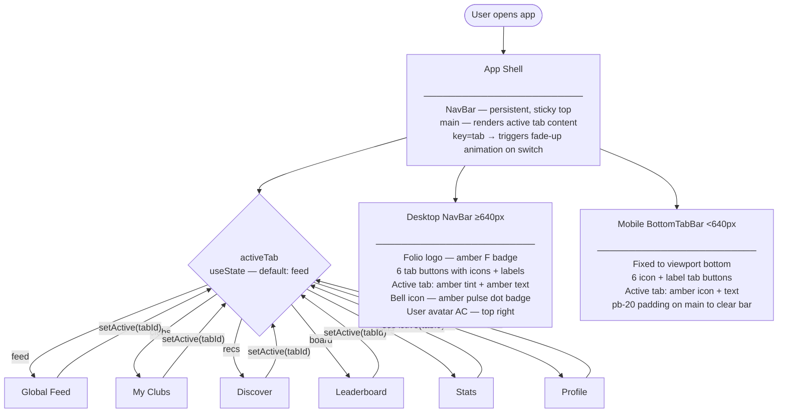

---

## 2. Feed Tab

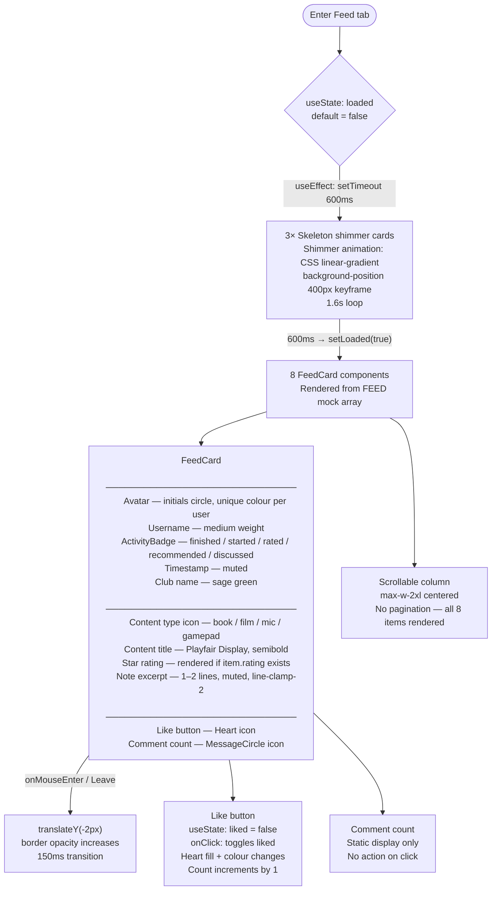

---

## 3. My Clubs — Grid View

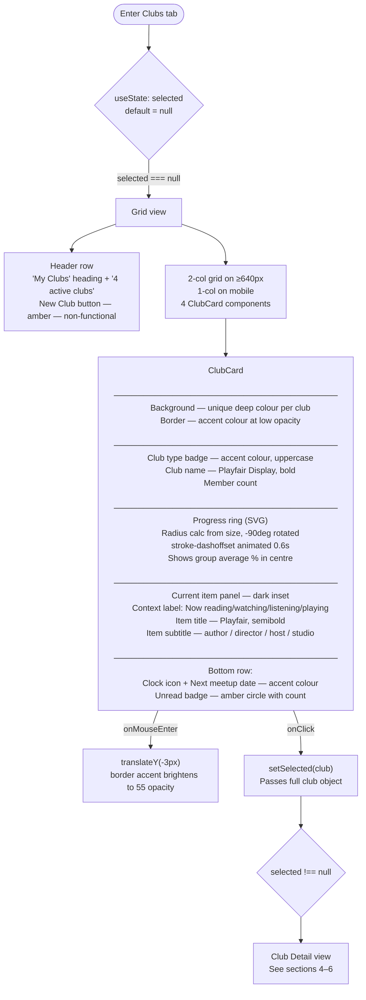

---

## 4. Club Detail — Discussion Sub-tab

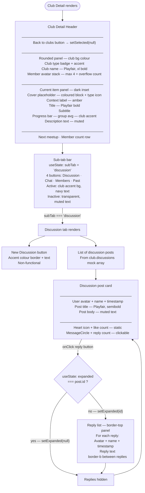

---

## 5. Club Detail — Chat Sub-tab

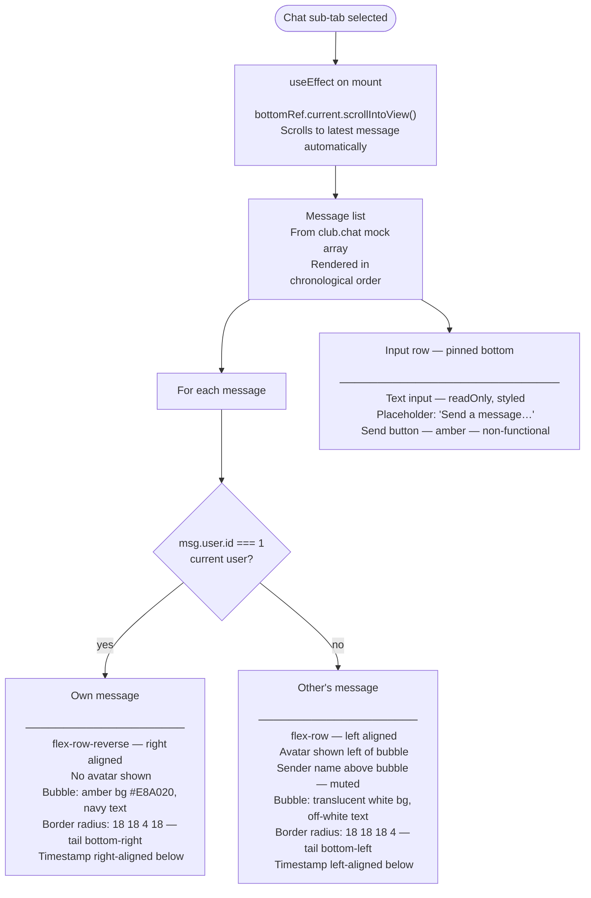

---

## 6. Club Detail — Members & Past Items Sub-tabs

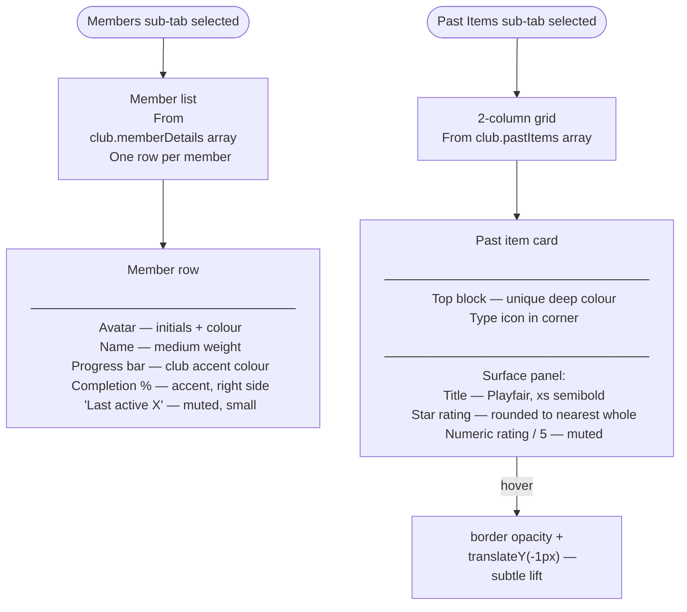

---

## 7. Discover Tab

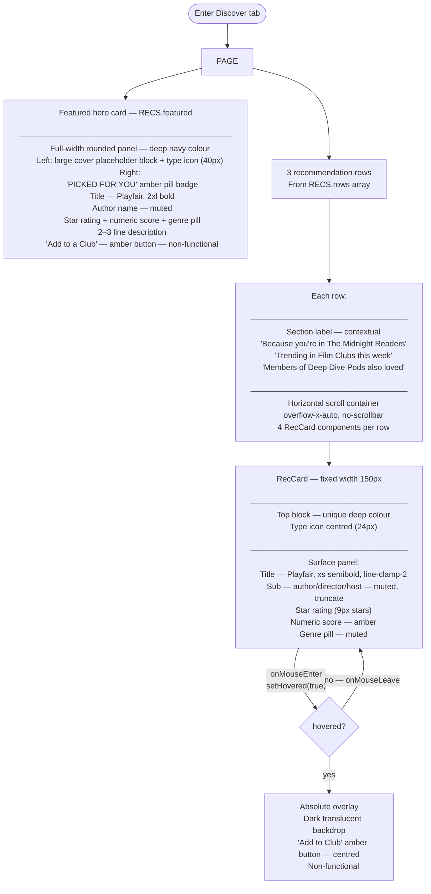

---

## 8. Leaderboard Tab

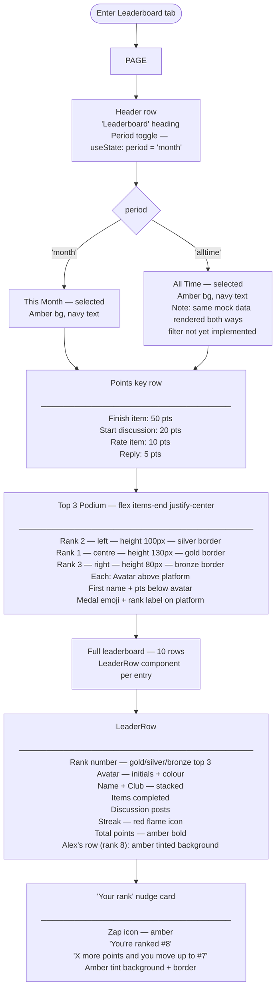

---

## 9. Stats Tab

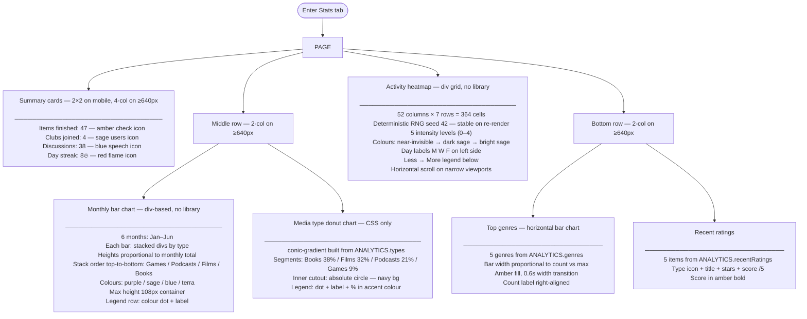

---

## 10. Profile Tab

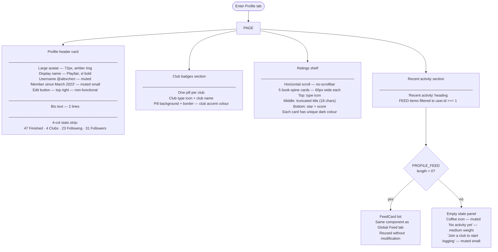

---

## 11. Loading, Empty & Responsive States

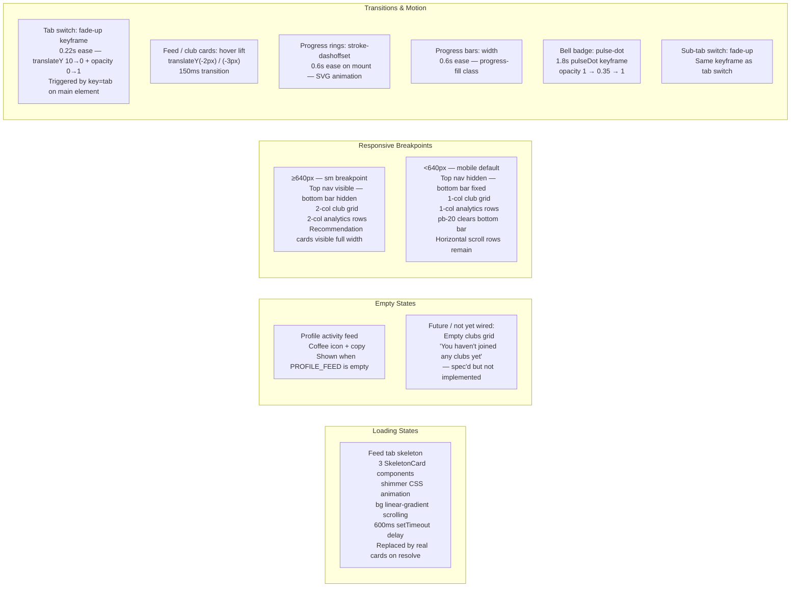

---

## 12. Interactive Element Inventory

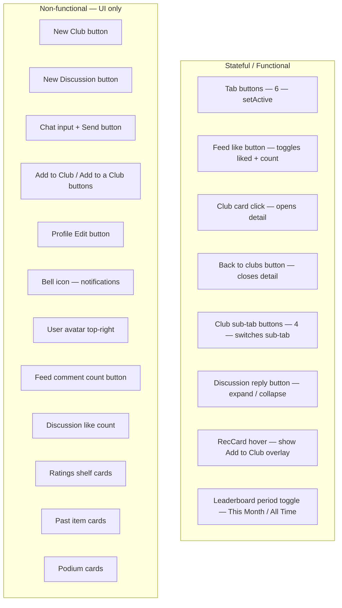

---

## 13. Data Flow & Component Map

```mermaid
flowchart TD
    subgraph DATA ["Mock Data — App.jsx module scope"]
        ME["ME — current user object"]
        USERS_D["USERS — 8 user objects"]
        CLUBS_D["CLUBS — 4 club objects
        Each contains: memberDetails
        discussions, chat, pastItems
        currentItem, memberIds"]
        FEED_D["FEED — 8 feed items
        References USERS by index"]
        RECS_D["RECS — featured + 3 rows × 4 items"]
        LB_D["LEADERBOARD — 10 entries
        References USERS by index"]
        ANALYTICS_D["ANALYTICS — summary, monthly
        types, genres, recentRatings"]
        PF_D["PROFILE_FEED — FEED filtered id===1"]
    end

    subgraph COMPONENTS ["Component Tree"]
        APP["App
        useState: activeTab"]
        NAVBAR["NavBar
        Props: active, setActive"]
        GLOBALFEED["GlobalFeed
        Uses: FEED"]
        MYCLUBS["MyClubs
        Uses: CLUBS
        useState: selected"]
        CLUBDETAIL["ClubDetail
        Props: club, onBack
        useState: subTab"]
        DISC_C["DiscussionTab
        Props: club
        useState: expanded"]
        CHAT_C["ChatTab
        Props: club
        useRef: bottomRef"]
        MEM_C["MembersTab
        Props: club"]
        PAST_C["PastItemsTab
        Props: club"]
        RECS_C["Recommendations
        Uses: RECS"]
        LB_C["Leaderboard
        Uses: LEADERBOARD
        useState: period"]
        ANALYTICS_C["Analytics
        Uses: ANALYTICS
        useMemo: heatmap data"]
        PROFILE_C["Profile
        Uses: ME, CLUBS, ANALYTICS
        Uses: PROFILE_FEED"]
    end

    APP --> NAVBAR & GLOBALFEED & MYCLUBS & RECS_C & LB_C & ANALYTICS_C & PROFILE_C
    MYCLUBS --> CLUBDETAIL
    CLUBDETAIL --> DISC_C & CHAT_C & MEM_C & PAST_C

    FEED_D --> GLOBALFEED
    CLUBS_D --> MYCLUBS & CLUBDETAIL & PROFILE_C
    RECS_D --> RECS_C
    LB_D --> LB_C
    ANALYTICS_D --> ANALYTICS_C & PROFILE_C
    ME --> NAVBAR & PROFILE_C
    PF_D --> PROFILE_C
```

---

## 14. Identified Gaps & Opportunities

Areas where the current prototype ends and a real product would begin.

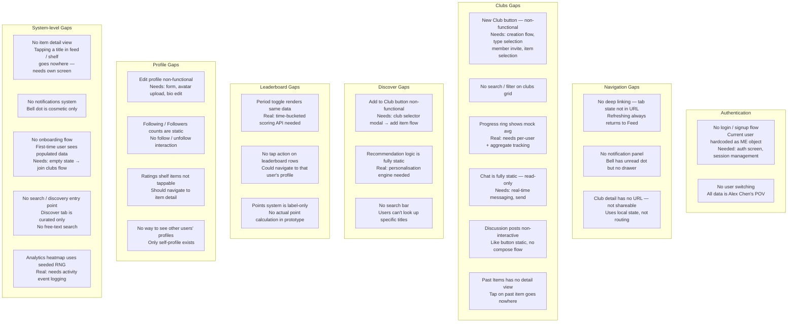

---

*Generated from the `src/App.jsx` source. Update this document when screens or flows change.*
